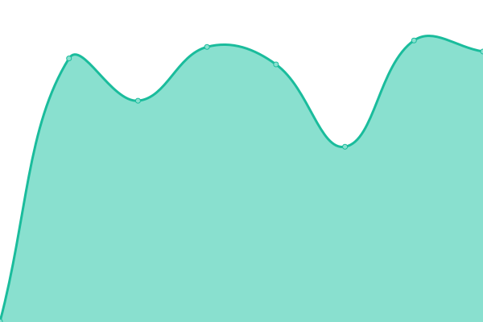

# [📈 Live Status](https://https://gradido.github.io/GradidoUpptime/): <!--live status--> **🟩 All systems operational**

This repository contains the open-source uptime monitor and status page for [Upptime](https://upptime.js.org), powered by [Upptime](https://github.com/upptime/upptime).

With [Upptime](https://upptime.js.org), you can get your own unlimited and free uptime monitor and status page, powered entirely by a GitHub repository. We use [Issues](https://github.com/upptime/upptime/issues) as incident reports, [Actions](https://github.com/Gradido/GradidoUpptime/actions) as uptime monitors, and [Pages](https://https://gradido.github.io/GradidoUpptime/) for the status page.

<!--start: status pages-->
<!-- This summary is generated by Upptime (https://github.com/upptime/upptime) -->
<!-- Do not edit this manually, your changes will be overwritten -->
<!-- prettier-ignore -->
| URL | Status | History | Response Time | Uptime |
| --- | ------ | ------- | ------------- | ------ |
|  [Stage1 Test1 Site Gradido](https://stage1.gradido.net) | 🟩 Up | [stage1-test1-site-gradido.yml](https://github.com/gradido/GradidoUpptime/commits/HEAD/history/stage1-test1-site-gradido.yml) | 

 466ms
     
 | 

<a href="https://https://gradido.github.io/GradidoUpptime//history/stage1-test1-site-gradido">100.00%</a>
    

|  [Stage2 Test2 Site Gradido](https://stage2.gradido.net) | 🟩 Up | [stage2-test2-site-gradido.yml](https://github.com/gradido/GradidoUpptime/commits/HEAD/history/stage2-test2-site-gradido.yml) | 

 467ms
     
 | 

<a href="https://https://gradido.github.io/GradidoUpptime//history/stage2-test2-site-gradido">100.00%</a>
    

|  [Site Gradido](https://gdd.gradido.net) | 🟩 Up | [site-gradido.yml](https://github.com/gradido/GradidoUpptime/commits/HEAD/history/site-gradido.yml) | 

 477ms
     
 | 

<a href="https://https://gradido.github.io/GradidoUpptime//history/site-gradido">100.00%</a>
    

<!--end: status pages-->

[**Visit our status website →**](https://https://gradido.github.io/GradidoUpptime/)

## 📄 License

- Powered by: [Upptime](https://github.com/upptime/upptime)
- Code: [MIT](./LICENSE) © [Upptime](https://upptime.js.org)
- Data in the `./history` directory: [Open Database License](https://opendatacommons.org/licenses/odbl/1-0/)
